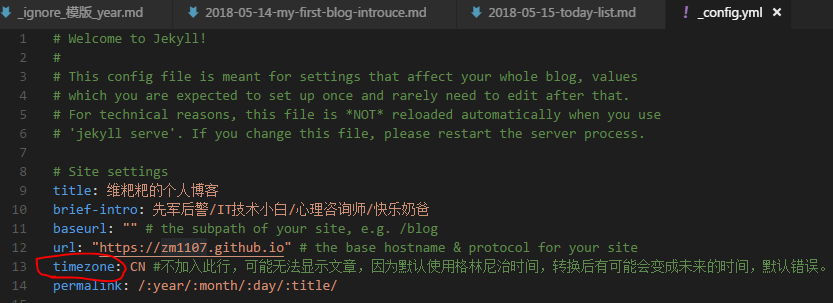
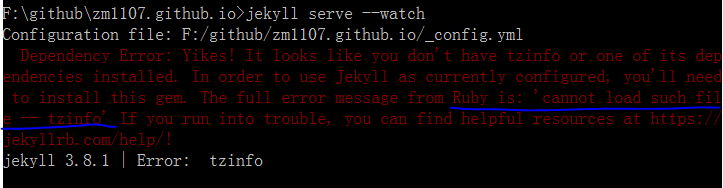
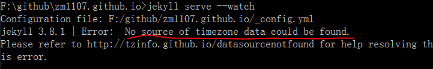
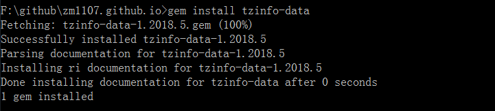

​	之前随便写了一篇文章，没什么实际内容，目的是自动生成一下目录和标签之类的，结果发现写好的文章，无法在网站上显示。开始以为哪里写错了，打开之前成功发布的，两相对比，发现除了时间不一样，其他完全相同，于是向前更改时间，结果又可以显示了。

​	万事不懂问谷歌，发现是由于jekyll默认把日期识别为格林尼治标准时间，然后再进行换算，这样比较靠后的时间，很容易换算成第二天，也就是明天，所以系统 就无法显示。

​	谷歌搜索后，扒遍github，有人说出了解决方法：在__config.yml文件中加入  timezone:CN，貌似有理！试试看：

提示找不到tzinfo，貌似是timezoneinfo的缩写。。。

好吧，我也不懂，直接安装试试：

`gem install tzinfo`

嗯，装上了！再运行`jekyll serve --watch`，还是出错

尼玛！又显示缺少时区数据的数据来源，我操！继续解决：

`gem install tzinfo-data`

完美！！回想一下

（1）在_config.yml文件里面添加timezone:CN

（2）出错后按提示安装tzinfo

（3）接着按提示安装tzinfo-data

各个步骤承前启后，完美！但是为什么运行jekyll服务还是出错！！

又上github翻，期间试过各种方法，搞不定！！

去尼玛，本来想解决bug，以后还是手动撸吧！！两种方法任选一种！

（1）文件头里面只用yyyy-mm-dd 不用HH:MM:SS，只设定日期，不设定具体时间，就没问题！

（2）非要用时间的话，最后加上时区信息！  如： 2018-05-15 22:53:16  +0800

PS:为了便于搜索，折腾期间曾出现的出错信息列在下面

cannot load such file -- tzinfo

no source of timezone data could be found

cannot load such file --tzinfo/data/definition/CN 

cannot load such file --tzinfo/data/definition