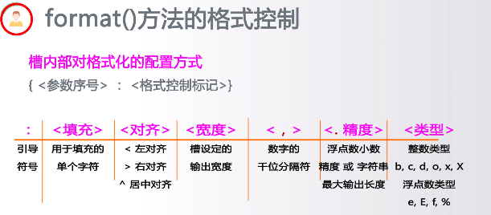

## 1、字符串类型及操作

### 字符串处理方法（8个）

```python
# 对于给定的字符串str
str.lower() 
str.upper()


str.split(sep=None) # 返回列表,根据被seq分隔的部分组成。
	例如，"A,B,C"。split(",")返回结果为：['A','B','C']
    
    
str.count(sub) #返回子串sub在str种出现的次数，
例如："an apple a day".cout("a")结果为4


str.replace(old,new)
# 返回字符串str的副本，所有old字串倍替换为new。
例如："python".replace("n","n123.io")结果为："python123.io"


str.center(width,[fillchar])
# 字符串str根据宽度width剧中，fillchar可选
例如："python".center(20,"=")结果为
'=======python======='

str.strip(chars)
# 从str种去掉在其左侧和右侧chars种列出的字符
"= python =".strip(" =np")结果为
"ytho"


str.join(iter)
# 在iter变量除最后元素外，每个元素后增加一个str
# 主要用于字符串分隔
",".join("12345")结果为
"1,2,3,4,5"
```


## 2.字符串类型的格式化

```python
"{}:计算机{}的CPU占用率为{}%".format("2018-10-10","C",10)

```

