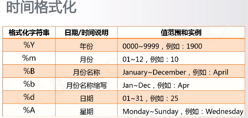
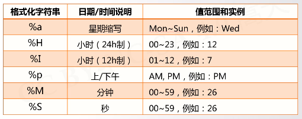
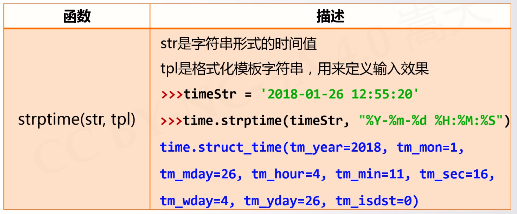
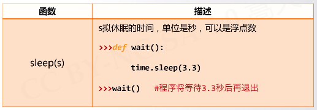

---

layout: post
title:  "python笔记：基本数据类型"
date:   1979-11-07 23:14:54 +0800
categories: 技术 学习 笔记
tags: python 编程 笔记 
excerpt: time库的使用		
mathjax: true
---

## 

## time库包括三类函数

### 1、时间获取

```python
time() #获取当前系统时间戳（1970.01.01 00：00：00 开始，到现在的秒数）
time.time()
>>> time.time()
1554376549.0608368

ctime() #获取易读形式的时间
>>> time.ctime()
'Thu Apr  4 19:16:27 2019'

gmtime() #获取计算机可以处理的时间格式
>>> time.gmtime()
time.struct_time(tm_year=2019, tm_mon=4, tm_mday=4, tm_hour=11, tm_min=16, tm_sec=51, tm_wday=3, tm_yday=94, tm_isdst=0)
```

### 2、时间格式化

将时间以合理的方式展示出来

```python
strftime()
strptime()
```





将时间以合理的方式(字符串形式)展示出来

```python
>>> t = time.gmtime()
>>> time.strftime("%Y-%m-%d %H:%M:%S",t)

'2019-04-04 11:26:34'
```




将字符串表示的时间，提取出来，变成计算机可以处理的形式（struc_time）

```python
>>> timestr = "2018-01-26 12:55:20"
>>> time.strptime(timestr,"%Y-%m-%d %H:%M:%S")
time.struct_time(tm_year=2018, tm_mon=1, tm_mday=26, tm_hour=12, tm_min=55, tm_sec=20, tm_wday=4, tm_yday=26, tm_isdst=-1)
```


### 3、程序计时

```python
perf_counter()
# 返回一个CPU级别的精确时间计数值，单位为秒。
# 由于这个计数值起点不确定，所以连续调用，计算差值才有意义

>>> time.perf_counter()
2622.679827594
#如上，单纯的给出一个计数值没有意义

>>> start = time.perf_counter()
>>> end = time.perf_counter()
>>> end - start
17.813864560000184
```



```python
>>> def wait():
        time.sleep(3.3)
 
>>> wait() # 函数运行后，等待3.3秒结束
```

